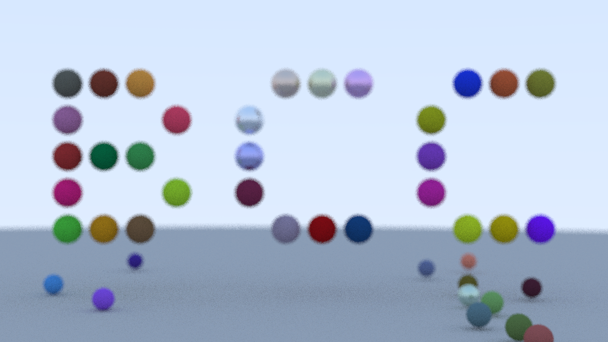

Projeto P2 - Ray Tracing in One Weekend
====================================================================================================

# Integrantes
- Gabriel Varano
- Gustavo dos Santos da Boa Morte
- Gustavo Rossini Ports
- Vinícius da Silva Lima

# Sobre a Cena
Para a criação da cena modificada, o número de esferas pequenas aleatórias já presente no código foi apenas diminuído, para não deixar a cena tão vazia.
A principal modificação foi a implementação de uma "matriz de desenho", onde nas suas posições em que o valor era 1, eram adicionadas esferas (de cor e material aleatórios) na cena, formando uma espécie de quadro de desenho vertical. Na imagem de exemplo, utilizamos a matriz para escrever "BCC".

A câmera também foi modificada, seguindo a especificação, para que o desenho produzido apareça corretamente na tela (no código só foi implementado para que a câmera esteja focada no centro da matriz, independente de seu tamanho, mas caso ela seja muito grande, pode ser que o desenho não caiba na tela).

Construção e Execução
---------------------
O projeto utiliza CMake e pode ser construído e executado da seguinte forma:

    $ cmake -B build
    $ cmake --build build --target inOneWeekend
	$ build/inOneWeekend > imagem.ppm

Caso não seja possível a visualização de um arquivo .ppm, ele pode ser convertido para .png com ImageMagick, executando:

    $ convert imagem.ppm imagem.png
